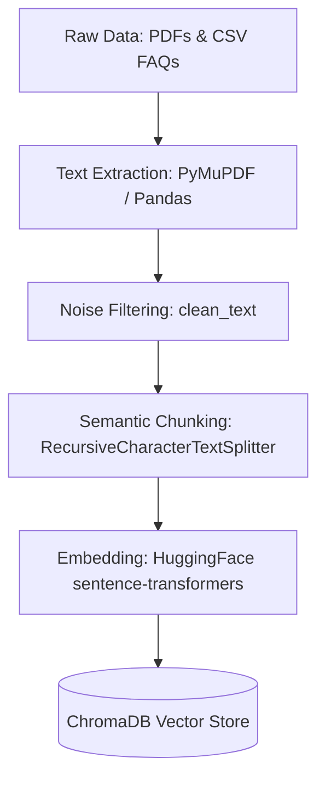
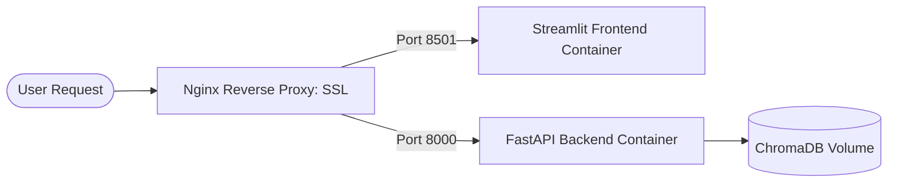

# SEAT Chat Bot: Multi-Stage Hallucination Mitigation RAG

The **SEAT Chat Bot** is a production-grade, multi-stage Retrieval-Augmented Generation (RAG) assistant designed for the **Siddartha Educational Academy Group of Institutions (SEAT), Tirupati**. It leverages advanced hallucination mitigation techniques, hybrid search, claim-level verification, and dynamic confidence scoring to provide highly reliable responses.

* **Hosted Website:** [https://seatbot.codewithsiva.dev/](https://seatbot.codewithsiva.dev/)
* **Backend API:** FastAPI (port 8000)
* **Frontend GUI:** Streamlit (port 8501)

---

## Table of Contents
1. [Core Features](#core-features)
2. [Data Preparation Pipeline](#data-preparation-pipeline)
3. [Multi-Stage RAG Pipeline Versions (V0 - V5)](#multi-stage-rag-pipeline-versions-v0---v5)
4. [Dockerization Setup](#dockerization-setup)
5. [DigitalOcean Deployment Guide](#digitalocean-deployment-guide)
6. [Local Development](#local-development)

---

## Core Features
* **Mitigation of Hallucinations:** Decomposes answers into atomic claims and verifies them individually against retrieved context.
* **Smart Source Citation:** Displays only the exact files (e.g., specific PDF or CSV FAQ datasets) that directly support verified claims, returning an empty list if the information is not found.
* **Hybrid Retrieval & Reranking:** Integrates dense vector search (ChromaDB) with lexical search (BM25) and a Cross-Encoder reranker.
* **Multi-Intent Query Decomposition:** Classifies queries and automatically splits compound questions into sub-queries to resolve them independently.
* **Confidence-based Escalation:** Automatically redirects low-confidence responses to human support instead of providing unverified answers.

---

## Models Used
To optimize performance, latency, and cost, the application coordinates several specialized models:
* **Primary Chat Generation LLM:** `llama-3.3-70b-versatile` (hosted on Groq) — Used for formulating the final coherent answers from verified contexts.
* **Reasoning / Claim Verification Model:** `llama-3.1-8b-instant` (hosted on Groq) — Decomposes generation outputs into facts and verifies them against source segments.
* **Semantic Embeddings Model:** `BAAI/bge-base-en-v1.5` (running locally on CPU via LangChain HuggingFace Embeddings) — Encodes document chunks for dense vector retrieval.
* **Reranking Cross-Encoder:** `BAAI/bge-reranker-base` (running locally on CPU via Sentence Transformers CrossEncoder) — Scores and reranks the retrieved dense and lexical candidate contexts.

---

## Data Preparation Pipeline

Located in [src/ingestion/prepare_data.py](file:///Users/sivaprasad/Desktop/m-tech-rag-project-23/src/ingestion/prepare_data.py) and [src/ingestion/create_chroma.py](file:///Users/sivaprasad/Desktop/m-tech-rag-project-23/src/ingestion/create_chroma.py).



### 1. Text Extraction
* **PDFs:** Page-by-page raw text extraction using PyMuPDF (`fitz`).
* **CSVs:** Structured FAQ parsing of query-answer rows using `pandas`.

### 2. Cleaning & Noise Filtering
* Filters out typical extraction noise (header/footer indicators, page numbers).
* Strips standalone digits and broken lines.
* Clears external web URLs to prevent parsing noise.

### 3. Chunking & Indexing
* Splits text using a `RecursiveCharacterTextSplitter` with defined character constraints.
* Indexes chunks into **ChromaDB** using local semantic embeddings and stores lexical indexes in `chunked_docs.json` for BM25.

---

## Multi-Stage RAG Pipeline Versions (V0 - V5)

The project implements a progression of RAG pipelines to demonstrate improvements in accuracy and hallucination mitigation:

| Version | Name | Key Pipeline Technologies | Hallucination Control |
| :--- | :--- | :--- | :--- |
| **V0** | [Basic RAG](file:///Users/sivaprasad/Desktop/m-tech-rag-project-23/src/versions/v0_basic_rag.py) | Dense Search (Chroma) + Groq LLM | LLM Prompt Instruction Only |
| **V1** | [Fallback RAG](file:///Users/sivaprasad/Desktop/m-tech-rag-project-23/src/versions/v1_fallback_rag.py) | BM25 Validation + DuckDuckGo Web Search | Prevents Out-Of-Domain Hallucination |
| **V2** | [Reranked RAG](file:///Users/sivaprasad/Desktop/m-tech-rag-project-23/src/versions/v2_reranked_rag.py) | Hybrid Search (BM25 + Chroma) + Cross-Encoder | Increases Relevance of Top context |
| **V3** | [Verified RAG](file:///Users/sivaprasad/Desktop/m-tech-rag-project-23/src/versions/v3_verified_rag.py) | Qwen Reasoning model (Claim extraction & verification) | Drops unverified claims; filters sources to supporting files |
| **V4** | [Escalated RAG](file:///Users/sivaprasad/Desktop/m-tech-rag-project-23/src/versions/v4_escalated_rag.py) | Sigmoid confidence scoring logic | Escalate responses below threshold |
| **V5** | [Intelligent RAG](file:///Users/sivaprasad/Desktop/m-tech-rag-project-23/src/versions/v5_intelligent_rag.py) | Query intent classifier + sub-query decomposition | Compound query validation |

---

## Dockerization Setup

The application is containerized into microservices to isolate dependencies and simplify multi-container deployments.

### Dockerfile
Uses `python:3.12-slim` and **uv** to install dependencies, freezing them via `uv.lock`. Exposes port `8000` (FastAPI) and `8501` (Streamlit).

### Docker Compose
Coordinates two main services:
1. `backend`: Runs the FastAPI server (`main:app`) on port `8000`.
2. `frontend`: Runs the Streamlit dashboard (`app.py`) on port `8501`, connecting to the backend via service DNS `http://backend:8000/api/v1`.

Persistent volumes are mapped for database and raw datasets:
* `./chroma_db:/app/chroma_db`
* `./data:/app/data`

---

## DigitalOcean Deployment Guide

This guide details deploying the application onto a DigitalOcean Droplet using Docker Compose, Nginx, and Let's Encrypt.



### Step 1: Provision a Droplet
1. Launch a new DigitalOcean Droplet (Ubuntu 22.04 LTS, recommended at least 2GB RAM / 1 vCPU).
2. Connect via SSH:
   ```bash
   ssh root@your_droplet_ip
   ```

### Step 2: Install Docker and Docker Compose
```bash
sudo apt update
sudo apt install -y docker.io docker-compose
sudo systemctl enable --now docker
```

### Step 3: Clone Repository & Setup Environment
1. Clone the repository onto the Droplet:
   ```bash
   git clone https://github.com/prasad230776/mtech-rag-project.git /opt/seat-chatbot
   cd /opt/seat-chatbot
   ```
2. Create your `.env` file containing required API Keys (e.g., GROQ, HUGGINGFACE):
   ```env
   GROQ_API_KEY=your_groq_api_key
   EMBEDDING_MODEL_NAME=sentence-transformers/all-MiniLM-L6-v2
   RERANKER_MODEL_NAME=cross-encoder/ms-marco-MiniLM-L-6-v2
   ```

### Step 4: Run Containers
Build and run the stack in detached mode:
```bash
docker-compose up --build -d
```

### Step 5: Configure Nginx & SSL Certbot
1. Install Nginx and Certbot:
   ```bash
   sudo apt install -y nginx certbot python3-certbot-nginx
   ```
2. Create an Nginx config file for domain mapping (`/etc/nginx/sites-available/seatbot`):
   ```nginx
   server {
       server_name seatbot.codewithsiva.dev;

       # Frontend Proxy
       location / {
           proxy_pass http://localhost:8501;
           proxy_http_version 1.1;
           proxy_set_header Upgrade $http_upgrade;
           proxy_set_header Connection "upgrade";
           proxy_set_header Host $host;
       }

       # Backend API Proxy
       location /api/v1 {
           proxy_pass http://localhost:8000/api/v1;
           proxy_set_header Host $host;
           proxy_set_header X-Real-IP $remote_addr;
       }
   }
   ```
3. Enable configuration and restart Nginx:
   ```bash
   sudo ln -s /etc/nginx/sites-available/seatbot /etc/nginx/sites-enabled/
   sudo nginx -t
   sudo systemctl restart nginx
   ```
4. Obtain an SSL certificate using Let's Encrypt:
   ```bash
   sudo certbot --nginx -d seatbot.codewithsiva.dev
   ```

---

## Local Development

If you prefer to run the application locally without Docker:

### Prerequisites
* Python 3.12+
* `uv` tool (recommended for package management)

### Setup
1. Clone and sync dependencies:
   ```bash
   uv sync
   ```
2. Run data preparation scripts to index PDFs and CSVs:
   ```bash
   uv run src/ingestion/prepare_data.py
   uv run src/ingestion/create_chroma.py
   ```
3. Start the Backend API:
   ```bash
   uv run uvicorn main:app --reload --port 8000
   ```
4. Start the Streamlit Frontend:
   ```bash
   uv run streamlit run app.py --server.port 8501
   ```
